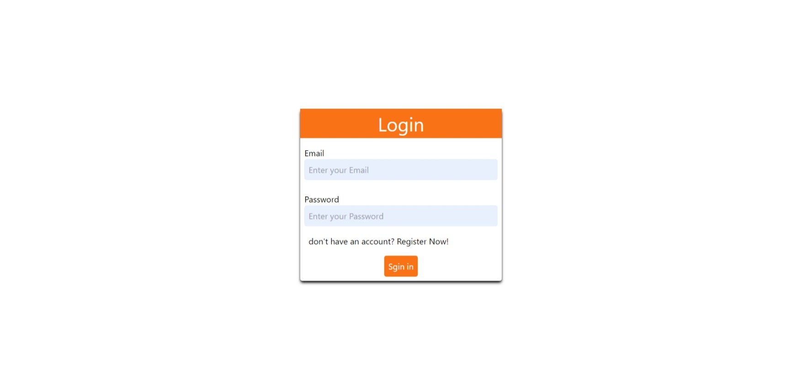
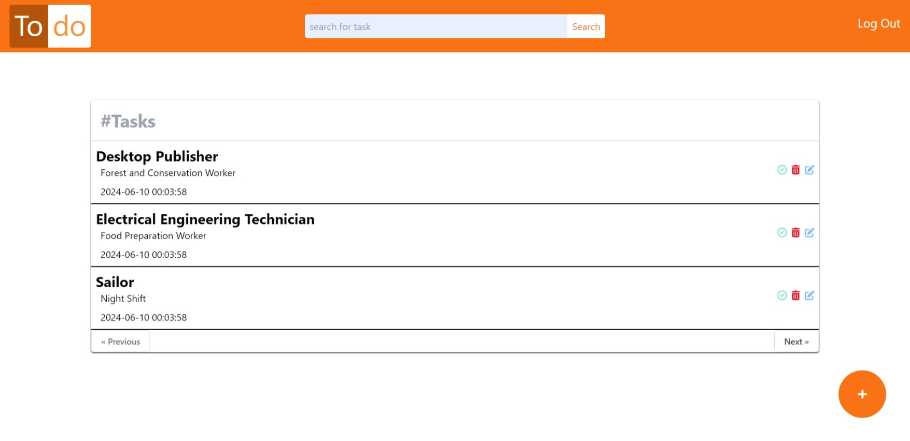

# Todo

## Table of contents

- [Overview](#overview)
- [Technologies and Tools](#Technologies%20and%20Tools)
- [Setup and Installation](#Setup_and_Installation)
- [Visuals](#Visuals)
- [Author](#author)

## Overview 

Simple Todo list web application, with powerful simple search engine and with robust Authentication&Authorization sub-system
and of course with No JS

##Technologies and Tools

### Frontend 

- Tailwind CSS 
- PHP BLADE

### Backend

- Laravel Framework
- Database Migration
- Database Seeder
- Session Token Concept for Authorization
- Facade\Auth for Identification

## Setup and Installation

### In order to run the project on your local machine, you have to install the following :

## Seeding Database

After setting up your Databse Configuration in Laravel, the time has come to seed the database.
just open terminal on the project directory and run the following artisan command:
- php artisan migrate --seed

this command will seed your database with 10 users each one has 10 tasks.

## Install Node.js Packges (For TailWindCSS Purposes)

- npm install

## Running Server 

- php artisan serve
- npm run dev

# Visuals

## Login Interface

## Home Interface

# Author

[Mohammed Ayman](https://www.linkedin.com/in/mohammed-ayman-385abb296/)

